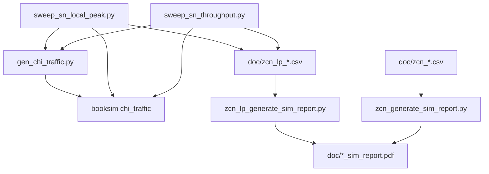

# BookSim2 CHI ZCN 仿真项目说明

本文档是 **booksim2** 目录的总览：在 Stanford BookSim 2.0 之上扩展的 CHI 一致性 NoC 仿真环境，用于评估 ZCN 场景下 SN（DDR）读写带宽、延迟与拓扑影响。

更细的操作步骤见 [`doc/simulation_guide.md`](doc/simulation_guide.md)；专项分析见 [`doc/upbound_analysis.md`](doc/upbound_analysis.md)、[`doc/zcn_topology_comparison.md`](doc/zcn_topology_comparison.md)。

---

## 1. 背景介绍

### 1.1 BookSim 与本项目的关系

[BookSim](README.md) 是 cycle-accurate 片上网络（NoC）仿真器，支持 mesh/torus 等拓扑、虚拟通道、wormhole 路由与 credit 流控。

本项目在 BookSim 上叠加：

- **CHI 风格流量模型**：读/写/dataless/CMO 事务按场景表展开为 REQ/RSP/SNP/DAT 四类 channel，每类消息映射为一个 traffic class。
- **6×7 / 7×6 mesh + 4 SN**：84 RN + 84 HN + 4 DDR SN（172 nodes），每 router 挂 2 RN + 2 HN。
- **补丁能力**：`class_subnet`（class → REQ/RSP/SNP/DAT 子网）、`class_source`（限制每 class 的注入源节点）、`anynet` 拓扑文件带链路权重（`link_latency`）。
- **自动化工具链**：Python 生成配置 → λ 扫描 → CSV 汇总 → PDF 报告。

### 1.2 研究目标

- 在固定微架构参数（`vc_buf=4`、`DATA_FLITS=2`、XY、`link_latency=2`）下，找到 **SN 本地 DAT 利用率** 的运行点 λ* 与饱和上限。
- 对比 **读 ceiling**（100% ReadShared DMT miss → CompData SN→RN）与 **写 ceiling**（100% WriteBack + L3EvictToSN）。
- 对比两种拓扑：**6×7 SN 在顶边**（`zcn`）与 **7×6 SN 在左右边中部**（`zcn_lp`）。
- 解释 SN 利用率为何难以达到 100%（credit RTT、HoL、分配器等，见 upbound 分析）。

### 1.3 两种拓扑（当前默认：7×6）

| 场景 | 前缀 | Mesh | SN 位置 | SN Router |
|------|------|------|---------|-----------|
| 历史 ZCN | `zcn_*` | 6×7 | 顶边 (0,1)(0,2)(0,4)(0,5) | R1/R2/R4/R5 |
| 当前 ZCN-LP | `zcn_lp_*` | **7×6（默认）** | 左/右列中部 (3,0)(4,0)(3,5)(4,5) | R18/R24/R23/R29 |

节点总数均为 172；SN node ID 均为 168–171。

---

## 2. 如何使用

### 2.1 环境准备

```bash
cd booksim2

# 编译 BookSim（首次或改 C++ 后）
cd src && make && cd ..

# Python 依赖（生成报告）
pip3 install matplotlib   # 若尚未安装
```

确认可执行文件存在：`src/booksim`。

### 2.2 目录约定

| 路径 | 作用 |
|------|------|
| `runfiles/` | **工作目录**：生成配置、跑仿真、跑 sweep |
| `doc/` | CSV 结果、PDF 报告、分析文档 |
| `src/` | BookSim 源码（C++） |

**所有 sweep 命令在 `runfiles/` 下执行**；报告脚本在 `doc/` 下执行。

### 2.3 典型工作流

```
gen_chi_traffic.py  →  chi_traffic + chi_traffic_anynet
        ↓
src/booksim chi_traffic   （单点验证）
        ↓
sweep_sn_local_peak.py    （λ 扫描，SN 本地 util，产出 CSV）
sweep_sn_throughput.py    （可选，E2E util + packet latency）
        ↓
doc/*_generate_sim_report.py  →  PDF/PNG
```

### 2.4 快速开始：ZCN-LP 全流程

```bash
cd runfiles

# 1) SN 本地峰值扫描（读/写 ceiling，密集 λ）
SWEEP_BUFS=4 CHI_VC_BUF_SIZE=4 CHI_DATA_FLITS=2 \
CHI_ROUTING=xy CHI_LINK_LATENCY=2 \
SWEEP_OUT=zcn_lp_sn_local_peak.csv \
SWEEP_STATS_DIR=stats_out/zcn_lp \
SWEEP_LAMBDAS="0.005 0.01 0.015 0.016 0.018 0.02 0.021 0.022 0.024 0.026 0.028 0.03 0.035 0.04 0.043" \
python3 sweep_sn_local_peak.py

# 2) 读/写 E2E ceiling（报告第 1 页延迟曲线需要）
# 读 mix
CHI_ROUTING=xy CHI_LINK_LATENCY=2 CHI_VC_BUF_SIZE=4 CHI_DATA_FLITS=2 \
CHI_READ_RATIO=100 CHI_WRITE_RATIO=0 CHI_DATALESS_RATIO=0 CHI_CMO_RATIO=0 \
CHI_READ_SHARED_RATIO=100 CHI_READ_DMT_MISS_RATIO=100 \
CHI_READ_L3_HIT_RATIO=0 CHI_READ_DCT_RATIO=0 \
SWEEP_OUT=zcn_lp_sn_read_ceiling.csv SWEEP_MAX_UNSTBL=999 \
SWEEP_LAMBDAS="0.005 0.01 0.015 0.016 0.018 0.02 0.021 0.022 0.024 0.026 0.028 0.03 0.035 0.04 0.043" \
python3 sweep_sn_throughput.py

# 写 mix：CHI_READ_RATIO=0 CHI_WRITE_RATIO=100 CHI_WRITE_BACK_RATIO=100 CHI_L3_EVICT_TO_SN_RATE=1.0
# SWEEP_OUT=zcn_lp_sn_write_ceiling.csv，其余同上

# 3) 生成报告
cd ../doc && python3 zcn_lp_generate_sim_report.py
```

输出：`doc/zcn_lp_sim_report.pdf`、`zcn_lp_sim_report_p1.png`、`zcn_lp_sim_report_p2.png`。

### 2.5 单点手动仿真

```bash
cd runfiles
CHI_ROUTING=xy CHI_LINK_LATENCY=2 CHI_VC_BUF_SIZE=4 CHI_DATA_FLITS=2 CHI_LAMBDA=0.02 \
  ... python3 gen_chi_traffic.py
../src/booksim chi_traffic | tee booksim.log
```

### 2.6 切换拓扑

`gen_chi_traffic.py` **默认 7×6 + 左右 SN**。复现 6×7 顶边 SN：

```bash
CHI_ROWS=6 CHI_COLS=7 CHI_SN_COORDS="0,1;0,2;0,4;0,5" \
  CHI_ROUTING=xy CHI_LINK_LATENCY=2 python3 gen_chi_traffic.py
```

然后使用 `zcn_*` 前缀的 `SWEEP_OUT` 与 `zcn_generate_sim_report.py` 生成对应报告。

---

## 3. 仿真配置及结果说明

### 3.1 核心仿真参数（ZCN 基准）

| 参数 | 典型值 | 环境变量 |
|------|--------|----------|
| 路由 | XY | `CHI_ROUTING=xy` |
| 链路延迟 | 2 cycle | `CHI_LINK_LATENCY=2` |
| VC buffer | 4 flit/VC | `CHI_VC_BUF_SIZE=4` |
| VC 数 | 2 | `CHI_VCS=2` |
| DAT 包长 | 2 flit（32 B） | `CHI_DATA_FLITS=2` |
| 注入率 | λ txn/node/cycle | `CHI_LAMBDA` |
| 源节点归一化 | 开 | `CHI_NODE_NORMALIZE=1` |
| 延迟指标 | Packet latency | `atime − ctime`（含源排队） |
| VC 分配器 | islip | `CHI_VC_ALLOCATOR=islip` |
| Switch 分配器 | separable_output_first | `CHI_SW_ALLOCATOR` |
| alloc_iters | 1 | 写在 `chi_traffic` 中 |

完整 `CHI_*` 列表见 `runfiles/gen_chi_traffic.py` 与 [`doc/simulation_guide.md`](doc/simulation_guide.md) §2。

### 3.2 流量 mix

| Mix | 用途 | 主要 CHI 设置 |
|-----|------|----------------|
| 默认混合 | 基线 | read 55% / write 30% / dataless 10% / cmo 5% |
| Read ceiling | 读上限 | 100% ReadShared DMT miss |
| Write ceiling | 写上限 | 100% WriteBack，`L3_EVICT_TO_SN_RATE=1.0` |

每个 CHI 事务展开为多 class 消息（REQ→HN→SN→DAT 等），详见 `chi_traffic` 头部 `// class ->` 注释。

### 3.3 关键指标

| 指标 | 含义 | 读 / 写看哪里 |
|------|------|----------------|
| **SN DAT avg/peak** | SN 终端 DAT 链路 flit/cycle（占 1.0 为 100%） | 读：`sent_flits@SN`；写：`accepted_flits@SN` |
| **SN REQ avg/peak** | 到达 SN 的 REQ | `accepted_flits@SN` on REQ class |
| **E2E DAT util** | 全网 accepted DAT / (4×SN 链路上限) | sweep 日志 / ceiling CSV |
| **Packet latency** | 端到端包延迟（含源队列） | ceiling CSV 列 `read_plat` / `write_plat` |
| **λ*** | 扫描中 **SN DAT avg 最大** 的 λ | `*_sn_local_peak.csv` |
| **state** | `ok` / `UNSTBL` / `SAT` | 见 simulation_guide §9 |

SN 终端统计来自 `sn_local_stats.m`（`stats_out`）；解读见 [`doc/stats_out/README.md`](doc/stats_out/README.md)。

### 3.4 仿真状态：ok 与 UNSTBL

BookSim 以 sample window（默认 1000 cycle）判断收敛：连续 3 窗内延迟/吞吐相对变化 < 5% 则为 **ok**；否则 **UNSTBL**（取最后一次 DisplayStats 快照）。

- **UNSTBL 通常表示 offered load 已超过饱和吞吐**，不等于“延迟一定很高”。
- **饱和证据**看 accepted util **平台值**，而非仅看 UNSTBL 标签。

详见 [`doc/simulation_guide.md`](doc/simulation_guide.md) §9 及 [`doc/upbound_analysis.md`](doc/upbound_analysis.md) §5。

### 3.5 主要结果产物

#### ZCN（6×7，顶边 SN）

| 文件 | 内容 |
|------|------|
| `doc/zcn_sn_local_peak.csv` | λ* 汇总 |
| `doc/zcn_sn_local_peak_sweep.csv` | 全 λ 曲线 |
| `doc/zcn_sn_read_ceiling.csv` | 读 E2E + packet latency |
| `doc/zcn_sn_write_ceiling.csv` | 写 E2E + packet latency |
| `doc/zcn_sim_report.pdf` | 2 页报告 |
| `doc/stats_out/zcn/` | 归档 stats |

参考结果（vc_buf=4）：Read λ*=0.021 / DAT avg 65.2%；Write λ*=0.042 / DAT avg 87.3%。

#### ZCN-LP（7×6，左右 SN，**当前默认**）

| 文件 | 内容 |
|------|------|
| `doc/zcn_lp_sn_local_peak.csv` | λ* 汇总 |
| `doc/zcn_lp_sn_local_peak_sweep.csv` | 全 λ 曲线 |
| `doc/zcn_lp_sn_read_ceiling.csv` | 读 ceiling |
| `doc/zcn_lp_sn_write_ceiling.csv` | 写 ceiling |
| `doc/zcn_lp_sim_report.pdf` | 2 页报告 |
| `doc/stats_out/zcn_lp/` | 归档 stats |

参考结果：Read λ*=0.024 / DAT avg 78.3%；Write λ*=0.040 / DAT avg 84.1%。

拓扑对比见 [`doc/zcn_topology_comparison.md`](doc/zcn_topology_comparison.md)。

### 3.6 SN 利用率为何到不了 100%

在 wormhole + credit + `vc_buf=4` 配置下，SN 链路 **62%–88%** 平台是结构性上限（credit RTT、HoL、分配器、随机注入等），非链路时钟降频。详见 [`doc/upbound_analysis.md`](doc/upbound_analysis.md)。

---

## 4. 仿真代码结构说明

### 4.1 仓库顶层

```
booksim2/
├── README.md              # 上游 BookSim 简介
├── PROJECT.md             # 本文档（项目总览）
├── src/                   # BookSim C++ 仿真内核
├── runfiles/              # CHI 配置生成、sweep、运行时产物
└── doc/                   # 结果 CSV、报告脚本、分析文档
```

### 4.2 `runfiles/` — 仿真与扫描

| 文件 | 说明 |
|------|------|
| **`gen_chi_traffic.py`** | **核心**：按 `CHI_*` 生成 `chi_traffic`（BookSim 配置）与 `chi_traffic_anynet`（拓扑）；展开 CHI 场景表为 ~129 traffic classes |
| `sweep_sn_local_peak.py` | 读/写 ceiling 下 λ 扫描；SN 本地 DAT/REQ；输出 `doc/<SWEEP_OUT>.csv` + 归档 `sn_local_stats.m` |
| `sweep_sn_throughput.py` | E2E SN DAT util + packet latency vs λ |
| `sweep_vc_buf.py` | vc_buf 敏感性（历史 v6 实验） |
| `analyze_bottleneck.py` | 单次运行瓶颈/延迟快照解析 |
| `chi_traffic` | 当前生成的 BookSim 配置（勿手改，由 gen 覆盖） |
| `chi_traffic_anynet` | anynet 拓扑（router 邻接 + node 挂载 + link weight） |
| `sn_local_stats.m` | 最近一次带 stats_out 的 per-node 统计 |
| `archive/` | 早期 mesh6x7、chi_v2 等实验脚本与配置 |

**数据流**：sweep 脚本 → 调 `gen_chi_traffic.py`（设 `CHI_LAMBDA` 等）→ 调 `../src/booksim chi_traffic` → 解析 log / stats → 写 `doc/*.csv`。

### 4.3 `doc/` — 结果与报告

| 文件 | 说明 |
|------|------|
| `simulation_guide.md` | 操作手册（参数、命令、FAQ、unstable 说明） |
| `upbound_analysis.md` | SN 利用率上限机理分析 |
| `zcn_topology_comparison.md` | 6×7 vs 7×6 对比 |
| `zcn_generate_sim_report.py` | 6×7 报告（读 `zcn_*` CSV） |
| `zcn_lp_generate_sim_report.py` | 7×6 报告（读 `zcn_lp_*` CSV） |
| `stats_out/README.md` | `sn_local_stats.m` 字段解读 |
| `archive/` | v5/v6 历史报告脚本与 CSV |

报告结构：

- **第 1 页**：拓扑图 + read/write **packet latency vs λ**（来自 ceiling CSV）
- **第 2 页**：SN DAT/REQ 峰值柱图、DAT avg vs λ、λ* 汇总表

### 4.4 `src/` — BookSim 内核（与本项目相关的扩展）

| 模块 | 路径 | 说明 |
|------|------|------|
| 主程序 | `main.cpp` | 读配置、跑 `TrafficManager::Run()` |
| 流量管理 | `trafficmanager.cpp/hpp` | 注入、路由、统计、收敛判定；**class_subnet / class_source** |
| 配置 | `booksim_config.cpp` | 默认参数（`sample_period`、`latency_thres`、`alloc_iters` 等） |
| 拓扑 | `networks/anynet.cpp` | 从文件读 mesh，支持 per-link latency |
| 分配器 | `allocators/` | islip、separable_output_first 等；`alloc_iters` 作用于迭代式分配器 |

CHI 相关配置字段（由 `gen_chi_traffic.py` 写入）：

- `class_subnet`：class → REQ(0)/RSP(1)/SNP(2)/DAT(3) 子网
- `class_source`：每 class 允许 inject 的 node 列表（如 SN-only、RN-only）
- `traffic`：`hotspot({{...}})` 目标节点集
- `injection_rate`：per-class 每源节点注入率（含 `CHI_NODE_NORMALIZE` 缩放）
- `anynet_cols`：mesh 列数，供 `xy_anynet` 维序路由

### 4.5 class 与 CHI channel 映射（概念）

```
RN 发起读 miss
  → REQ (RN→HN) → REQ (HN→SN) → DAT (SN→RN CompData) + RSP ...

HN 异步 L3 evict
  → REQ (HN→SN) → DAT (HN→SN L3EvictData) + RSP ...
```

每个箭头对应 BookSim 一个 **traffic class**；sweep 脚本通过 `chi_traffic` 注释与 `class_subnet`/`class_source`/hotspot 自动识别「读 DAT」「写 DAT」「REQ→SN」类 ID。

### 4.6 脚本依赖关系



---

## 5. 文档索引

| 文档 | 内容 |
|------|------|
| **PROJECT.md**（本文） | 项目总览 |
| [simulation_guide.md](doc/simulation_guide.md) | 详细操作、参数、FAQ |
| [upbound_analysis.md](doc/upbound_analysis.md) | SN 为何达不到 100% util |
| [zcn_topology_comparison.md](doc/zcn_topology_comparison.md) | 6×7 vs 7×6 结果对比 |
| [stats_out/README.md](doc/stats_out/README.md) | per-node 统计文件格式 |
| [README.md](README.md) | 上游 BookSim 引用与版权 |

---

## 6. 常见问题

**Q：改拓扑后 sweep 要不要改脚本？**  
A：不必。`sweep_*.py` 从生成的 `chi_traffic` 解析 SN 节点与 class ID；改 `CHI_ROWS`/`CHI_COLS`/`CHI_SN_COORDS` 即可。

**Q：BookSim 退出码 255 是否失败？**  
A：本仓库中 **成功收敛时 exit code 常为 -1（即 255）**；应看 log 是否含 `Overall Traffic Statistics` 及 `Simulation unstable` 字样。local_peak 脚本对 rc 的处理较保守，部分低点可能 skip，高 λ 区数据仍可用于 λ*。

**Q：读/写 SN 流量曾严重不对称？**  
A：需确认 `CHI_NODE_NORMALIZE=1`（默认）。关闭后 SN 源（4 节点）相对 RN（84 节点）会被低估约 21×。

**Q：历史 v5/v6 文件在哪？**  
A：`doc/archive/`、`runfiles/archive/`；当前主线以 `zcn_*` / `zcn_lp_*` 为准。
