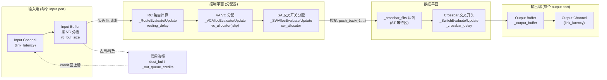
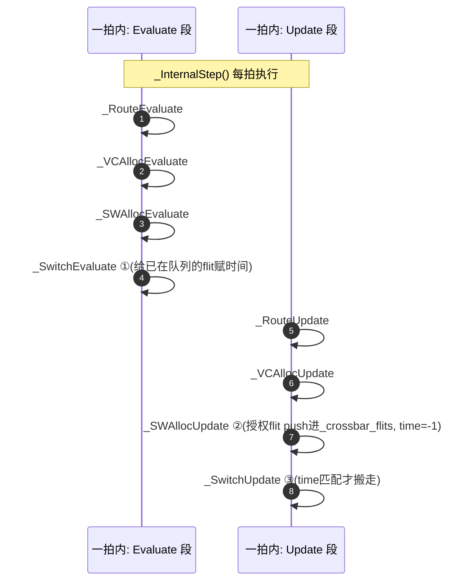
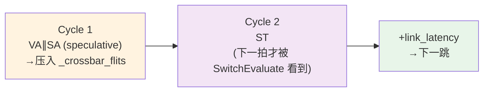
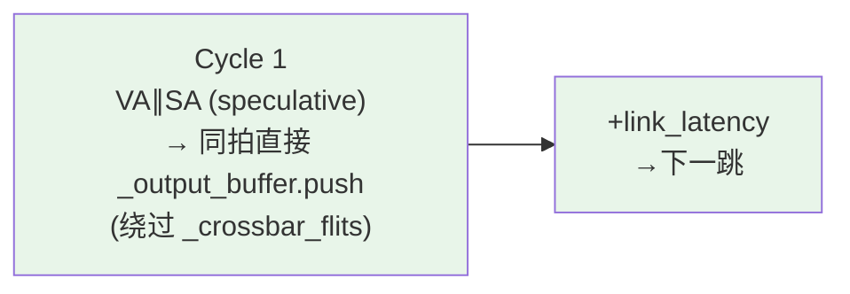

# REQ-only 定制流量仿真（req_custom）

单点仿真：仅 REQ 通道，指定 RN→HN，`link_latency=1`，每源 RN `injection_rate=0.2`，
路由器为**真正的 1-cycle port-to-port 路由器**（通过对 `iq_router.cpp` 打补丁实现）。

## 配置

| 项 | 值 |
|----|-----|
| 拓扑 | 7×6 mesh（与 ZCN-LP 相同，含 4 个侧边 SN，本 mix 不使用 SN） |
| 路由 | `xy` |
| `link_latency` | **1** |
| `vc_buf_size` | 4 |
| `num_vcs` | 2 |
| 通道 | **仅 REQ**（`class_subnet={0}`），`packet_size=1` |
| 注入 | 每源 RN **0.2** pkt/cycle |

### 路由器架构与流水线图解

#### 内部数据通路（结构图）



flit 进来先按 VC 存进 input buffer；控制面（RC/VA/SA）只搬请求/令牌，真正搬数据的是 crossbar。
SA 授权后 flit 被塞进 `_crossbar_flits`（ST 等待区），下一步过 crossbar 进 output buffer，最后上 output channel。

#### 原生 4-cycle 流水（head flit）

默认非 speculative，每阶段占 1 拍：


**= 4 cycle port-to-port**（RC+VA+SA+ST），再加 `link_latency` 到下一跳。

#### 每拍 Evaluate/Update 执行顺序（2-cycle 下限的根因）

BookSim 每拍 `_InternalStep()` 里所有 Evaluate 先跑、Update 后跑，且 ST 的 Evaluate 排在 SA 的 Update 之前：



② 本拍才把 flit 放进 `_crossbar_flits`（time=-1），但赋完成时间的 ① 本拍已跑过，看不到它 → 必须等下一拍。
所以即使 look-ahead RC + speculative（VA∥SA 合成 1 拍），仍剩：



**= 2 cycle**，这是原生下限。本项目补丁把 ②③ 合到同一拍（见下），消掉 Cycle 2，得到真正的 1 cycle。

### 路由器流水线（真正的 1-cycle）

原生 BookSim IQ router 的最快配置只能到 **2 cycle**：即使 `routing_delay=0`（look-ahead RC）、
`speculative=1`（VA/SA 并行），SA 授权的 flit 也要在**下一个 cycle**才做 crossbar traversal（ST），
因为被授权 flit 先压入 `_crossbar_flits`，而 `_SwitchEvaluate` 在同一 `_InternalStep` 里先于
`_SWAllocUpdate` 执行——这天然造成 SA→ST 的 1 拍间隔（且 `st_final_delay=0` 会触发断言）。

为得到**真正的 1-cycle** 路由器，本项目对 `src/routers/iq_router.cpp` 打了一个补丁：当
`crossbar_delay == 0`（即 `st_prepare_delay=st_final_delay=0`）时，在 `_SWAllocUpdate` /
`_SWHoldUpdate` 里**直接把被授权 flit 写入输出缓冲**（复现 `_SwitchUpdate` 的
`_switchMonitor->traversal()` + `_output_buffer[output].push()`），而不再经过 `_crossbar_flits`
延迟一拍。这样 SA 与 ST 合并到同一 cycle。其余延迟≥1 的配置行为不变（向后兼容）。

打补丁后（`_crossbar_delay==0`）的流水：



**= 1 cycle port-to-port**。

本实验默认：

| 参数 | 值 | 说明 |
|------|-----|------|
| `speculative` | 1 | VA/SA 并行，取 `max(VA,SA)` |
| `routing_delay` | 0 | look-ahead RC |
| `vc_alloc_delay` | 1 | |
| `sw_alloc_delay` | 1 | |
| `st_prepare_delay` | 0 | crossbar bypass |
| `st_final_delay` | 0 | crossbar bypass |

**有效 router port-to-port 延迟 = max(VA,SA) = 1 cycle**（线性链实测验证：per-hop=router+link=2、link=1 ⇒ router=1；
此前默认非 speculative 的 RC+VA+SA+ST=4，speculative 未打补丁=2）。

可用环境变量覆盖：`CHI_SPECULATIVE`、`CHI_ROUTING_DELAY`、`CHI_VC_ALLOC_DELAY`、
`CHI_SW_ALLOC_DELAY`、`CHI_ST_PREPARE_DELAY`、`CHI_ST_FINAL_DELAY`。

### 发送端（8 个 RN）

| Router | RN 数量 | Node ID |
|--------|---------|---------|
| R4 | 2 | 16, 17 |
| R5 | 2 | 20, 21 |
| R13 | 1 | 52 |
| R14 | 1 | 56 |
| R15 | 1 | 60 |
| R16 | 1 | 64 |

### 接收端（16 个 HN）

“一个 HN”统一取该 router 的 **第一个 HN**（`base+2`）；R4 取两个 HN（`base+2`, `base+3`）。

| Router | HN 数量 | Node ID |
|--------|---------|---------|
| R3 | 1 | 14 |
| R4 | 2 | 18, 19 |
| R5 | 1 | 22 |
| R13–R16 | 各 1 | 54, 58, 62, 66 |
| R25–R28 | 各 1 | 102, 106, 110, 114 |
| R37–R40 | 各 1 | 150, 154, 158, 162 |

流量：`hotspot` 均匀打到上述 16 个 HN。

## 如何复现

```bash
cd booksim2/runfiles
python3 gen_req_custom_traffic.py          # 生成 chi_traffic + chi_traffic_anynet
../src/booksim chi_traffic | tee ../doc/req_custom_booksim.log
```

可选覆盖：`CHI_LINK_LATENCY`、`CUSTOM_INJ` / `CHI_LAMBDA`、`CHI_VC_BUF_SIZE`、`CHI_ROUTING`，
以及上述 router 流水线变量。

生成脚本：[`../runfiles/gen_req_custom_traffic.py`](../runfiles/gen_req_custom_traffic.py)

## 结果摘要（已收敛 `ok`）

| 指标 | 4-cycle router | ~2-cycle (speculative) | **1-cycle (patched)** |
|------|----------------|------------------------|------------------------|
| Packet latency | 28.4 cycles | 17.3 cycles | **12.34** cycles |
| 平均 hops | 5.00 | 5.00 | 5.00 |
| Injected pkt rate | — | — | 0.00919 |
| Accepted pkt rate | — | — | 0.00921 |

相对 4-cycle 路由器，1-cycle 路由器延迟下降约 **16 cycle**；相对 speculative 的 2-cycle 再降约 **5 cycle**，
与 hops≈5、每 hop 再省 1 cycle 的量级一致。

## 产物

| 文件 | 说明 |
|------|------|
| `req_custom_summary.csv` | 汇总指标（含流水线参数） |
| `req_custom_per_node.csv` | 各源/目的节点 sent / accepted |
| `req_custom_stats.m` | BookSim `stats_out` |
| `req_custom_booksim.log` | 完整仿真日志 |
| `req_custom_chi_traffic` | 当时使用的配置备份 |
| `req_custom_chi_traffic_anynet` | 拓扑备份 |
